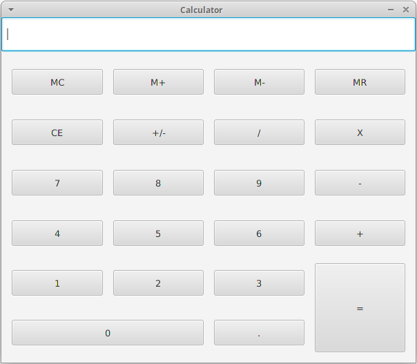

# Calculator
Создать калькулятор.

## Development steps
- Создать проект с названием `calculator`
- Создать `view` (т.е. UI)
- Создать `controller`
- Добавить `listeners`, для `events` "нажатиe на `buttons`", которые выводят в `console` строку `Pressed: ${buttonName}`
- Привязать `field` в `view` к `controller`
- Усовершенствовать `listeners`, который для `events` будет выводить в `field` соответствующая цифра/символ
- Усовершенствовать `listeners`, который для `events` будет добавлять в `field` соответствующую цифра/символ к текущему содержимому (т.е. не будет замены текущего содержимого)
- Усовершенствовать `listeners`, который для `events` "нажатие на `Button CE`" будет очищать `field`
- Усовершенствовать `listeners`, который для `events` "нажатие на `Button =`" будет выводить в `field` результат введенной операции
- **Добавить валидацию выражения для вычисления и вывод информации в случае ошибки