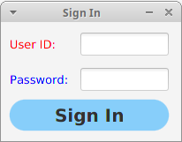

# Sign In
Создание окна входа в приложение.

## Development steps
- Создать проект с названием `sign-in`
- Создать `view` (т.е. UI)
- Создать `controller`
- Добавить `listener`, для `event` "нажатиe на `button` `sign in`", который выведет в `console` строку `Pressed: sign in`
- Создать `style` для `view`
- Привязать все `fields` в `view` к `controller`
- Усовершенствовать `listener`, который для `event` будет выводить в `console` строку `{"userId": "${userId}","password":"${password}"}`
- Усовершенствовать `listener`, который для `event` будет проверять является ли пользователь администратором (admin/admin). Выводить в окне о статусе авторизации `Permission denied`/`Access successful`
- **Создать хранилище пользователей и проверять с его помощью `credentials` пользователя